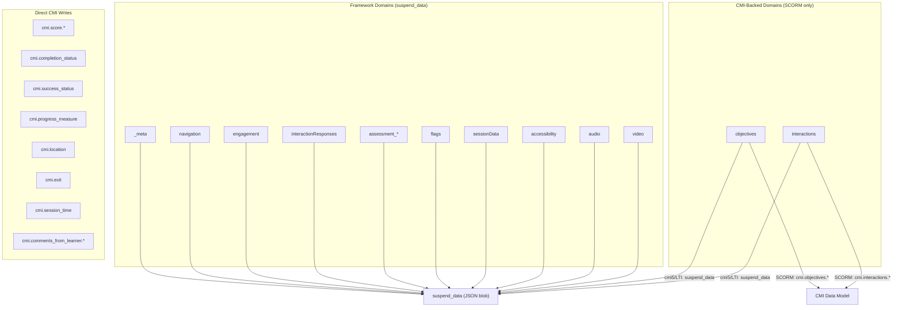

# CourseCode Data Model Reference

> **Intended Audience: AI Agents** — This document is a machine-readable data model reference for AI agents. For human-readable documentation, see `USER_GUIDE.md`.

Complete reference for all learner data managed by the framework. The framework uses a **domain-based state model** that is transport-agnostic — the same domains exist regardless of whether the delivery format is SCORM 1.2, SCORM 2004, cmi5, or LTI. The state module ([state/](../js/state/)) routes each domain to the appropriate storage mechanism.

> [!TIP]
> **For framework internals** (drivers, managers, architecture), see [`FRAMEWORK_GUIDE.md`](./FRAMEWORK_GUIDE.md).

---

## Storage Architecture



### Per-Format Routing

| Storage | SCORM 1.2 / 2004 | cmi5 | LTI |
|---------|-------------------|------|-----|
| `suspend_data` domains | ✅ | ✅ | ✅ (host provides) |
| CMI-backed `objectives` | `cmi.objectives.*` | suspend_data | suspend_data |
| CMI-backed `interactions` | `cmi.interactions.*` (append-only) | suspend_data | suspend_data |
| Direct CMI writes | ✅ | Via xAPI statements | Score via LTI AGS |
| `cmi.location` | ✅ | ✅ (suspend_data key) | ✅ (host provides) |

---

## Access Pattern

All state access flows through `stateManager` — the sole public API from the [state/](../js/state/) module:

```javascript
import stateManager from '../state/index.js';

// Read/write domain state
stateManager.getDomainState('navigation');
stateManager.setDomainState('navigation', { visitedSlides: ['intro', 'slide-01'] });

// Semantic LMS operations (delegated to the driver internally)
stateManager.reportScore({ raw: 85, scaled: 0.85, min: 0, max: 100 });
stateManager.reportCompletion('completed');
stateManager.setBookmark('slide-03');
stateManager.flush(); // Force immediate commit
```

> [!IMPORTANT]
> **Never import `lms-connection.js` or driver modules directly.** All LMS communication flows through `stateManager`.

---

## Domain Schemas

### `_meta`

Internal metadata for state versioning. Managed by [state-validation.js](../js/state/state-validation.js).

```js
{
  schemaVersion: number,    // e.g. 1 — used for state migration on course updates
  createdAt: string,        // ISO 8601 timestamp
  lastValidatedAt?: string  // Set after validation against course structure
}
```

---

### `navigation`

Slide visit tracking. Managed by [NavigationState.js](../js/navigation/NavigationState.js).

```js
{
  visitedSlides: string[]  // Array of slide IDs the learner has visited
}
```

> `currentSlideIndex` is runtime-only (not persisted). `cmi.location` is the authoritative bookmark.

---

### `engagement`

Engagement tracking for navigation gating. Managed by [engagement-manager.js](../js/engagement/engagement-manager.js).

```js
{
  [slideId: string]: {
    required: boolean,
    complete: boolean,
    tracked: {
      tabsViewed: string[],
      tabsTotal: number,
      accordionPanelsViewed: string[],
      accordionPanelsTotal: number,
      flipCardsViewed: string[],
      flipCardsTotal: number,
      flipCardsRegistered: string[],
      interactiveImageHotspotsViewed: string[],
      interactiveImageHotspotsTotal: number,
      modalsViewed: string[],
      modalsTotal: number,
      modalsAudioComplete: string[],
      lightboxesViewed: string[],
      lightboxesTotal: number,
      timelineEventsViewed: string[],
      timelineEventsTotal: number,
      interactionsCompleted: { [interactionId: string]: { completed: boolean, correct: boolean } },
      scrollDepth: number,          // 0-100
      audioComplete: boolean,       // Slide-level audio
      standaloneAudioComplete: string[],
      videoComplete: boolean,       // Slide-level video
      standaloneVideoComplete: string[]
    }
  }
}
```

> Only slides with `engagement.required = true` in the course config get state entries. Non-required slides are skipped to save space.

---

### `interactionResponses`

Learner responses for standalone interactions (outside assessments). Managed by [interaction-base.js](../js/components/interactions/interaction-base.js).

```js
{
  [interactionId: string]: {
    response: any,       // Format depends on interaction type
    submitted: boolean   // Whether the learner has submitted (clicked Check)
  }
}
```

#### Dual Storage Pattern

Standalone interactions use two storage mechanisms:

| Storage | Domain | Purpose | Pattern |
|---------|--------|---------|---------|
| `cmi.interactions.n.*` | `interactions` | LMS reporting, audit trail | Append-only (each Check = new record) |
| `suspend_data` | `interactionResponses` | UI state restoration | Key-value (latest state only) |

**Why?** CMI interactions are append-only by spec — same ID appears multiple times (one per attempt). Can't use CMI for restoration, so `interactionResponses` stores `{ response, submitted }` for O(1) lookup.

---

### `assessment_${assessmentId}`

Per-assessment state. Each assessment gets its own domain (e.g. `assessment_final-exam`). Managed by [AssessmentState.js](../js/assessment/AssessmentState.js).

```js
{
  summary: {
    attempts: number,
    passed: boolean,
    lastResults: {
      scorePercentage: number,  // 0-100
      scoreRaw: number,
      scoreMax: number,
      passed: boolean,
      correctCount: number,
      incorrectCount: number,
      totalQuestions: number
    }
  },
  session: {
    currentView: string,           // 'instructions' | 'question' | 'results' | 'review'
    currentQuestionIndex: number,
    startTime: number,             // Date.now() timestamp
    submitted: boolean,
    attemptNumber: number,
    responses: { [questionId: string]: any },
    selectedQuestions: string[],   // Question IDs (may be randomized subset)
    reviewReached: boolean
  },
  discardedAttempts: any[]  // Previous attempt data kept for audit
}
```

---

### `flags`

Arbitrary key-value flags for custom course logic. Managed by [flag-manager.js](../js/managers/flag-manager.js).

```js
{
  [key: string]: any  // Boolean, string, number — any serializable value
}
```

---

### `sessionData`

Slide timing data. Managed by [AppActions.js](../js/app/AppActions.js).

```js
{
  slideStartTimes: { [slideId: string]: number },  // Date.now() timestamps
  slideDurations: { [slideId: string]: number }     // Accumulated milliseconds
}
```

---

### `accessibility`

Learner accessibility preferences. Managed by [accessibility-manager.js](../js/managers/accessibility-manager.js).

```js
{
  theme: 'light' | 'dark',
  fontSize: 'normal' | 'large',
  highContrast: boolean,
  reducedMotion: boolean
}
```

---

### `audio`

Audio playback state. Managed by [audio-manager.js](../js/managers/audio-manager.js).

```js
{
  positions: { [contextId: string]: number },    // Playback position in seconds
  completions: { [contextId: string]: boolean }, // Whether audio has been completed
  muted: boolean                                 // Learner's mute preference
}
```

---

### `video`

Video playback state. Managed by [video-manager.js](../js/managers/video-manager.js).

```js
{
  positions: { [contextId: string]: number },    // Playback position in seconds
  completions: { [contextId: string]: boolean }, // Whether video has been completed
  isMuted: boolean                               // Learner's mute preference
}
```

---

### `objectives` (CMI-backed)

Learning objectives. Managed by [objective-manager.js](../js/managers/objective-manager.js). Routed to `cmi.objectives.*` on SCORM, or `suspend_data` on cmi5/LTI.

```js
{
  [objectiveId: string]: {
    id: string,
    completion_status: 'completed' | 'incomplete',
    success_status: 'passed' | 'failed' | 'unknown',
    score: number | null   // 0-100
  }
}
```

---

### `interactions` (CMI-backed)

Interaction records for LMS reporting. Managed by [interaction-manager.js](../js/managers/interaction-manager.js). **Append-only** on SCORM (`cmi.interactions.*`), or in `suspend_data` on cmi5/LTI.

```js
{
  id: string,
  type: string,              // 'choice' | 'true-false' | 'fill-in' | 'matching' | 'sequencing' | 'numeric' | 'other'
  learner_response: string,  // SCORM wire format ([,] delimiters, [.] pair separators)
  result: string,            // 'correct' | 'incorrect' | 'neutral'
  timestamp: string,         // ISO 8601
  correct_responses?: string,
  latency?: string,
  description?: string,
  weighting?: number
}
```

---

## Direct CMI Writes

These are written directly by `stateManager` semantic methods and are **not** part of domain state. They flow through the driver to the LMS.

| CMI Key | Written By | Value | Notes |
|---------|-----------|-------|-------|
| `cmi.score.raw` | `stateManager.reportScore()` | `0` – `100` | Via [score-manager.js](../js/managers/score-manager.js) |
| `cmi.score.scaled` | `stateManager.reportScore()` | `0` – `1` | raw / 100 |
| `cmi.score.min` | `stateManager.reportScore()` | `0` | Always 0 |
| `cmi.score.max` | `stateManager.reportScore()` | `100` | Always 100 |
| `cmi.completion_status` | `stateManager.reportCompletion()` | `completed` / `incomplete` | |
| `cmi.success_status` | `stateManager.reportSuccess()` | `passed` / `failed` / `unknown` | |
| `cmi.progress_measure` | `stateManager.updateProgressMeasure()` | `0` – `1` | Fraction of slides visited |
| `cmi.location` | `stateManager.setBookmark()` | Slide ID string | Authoritative bookmark |
| `cmi.exit` | `stateManager.exitCourseWithSuspend()` | `suspend` / `normal` | Set on exit |
| `cmi.session_time` | `stateManager.terminate()` | ISO 8601 duration | Calculated on terminate |
| `cmi.comments_from_learner.*` | [comment-manager.js](../js/managers/comment-manager.js) | Comment text + timestamp | Append-only |

---

## suspend_data Serialization

All domain states combine into a single JSON object stored in `cmi.suspend_data`:

```js
{
  _meta: { schemaVersion: 1, createdAt: '2026-...' },
  navigation: { visitedSlides: [...] },
  engagement: { ... },
  interactionResponses: { ... },
  assessment_quiz1: { ... },
  flags: { ... },
  sessionData: { ... },
  accessibility: { ... },
  audio: { ... },
  video: { ... },
  // cmi5/LTI only (SCORM uses CMI arrays):
  objectives: { ... },
  interactions: { ... }
}
```

> [!NOTE]
> **Compression:** `cmi.suspend_data` is automatically compressed via `lz-string` (UTF16) in the driver layer. This is transparent to all consumers.

> [!NOTE]
> For SCORM, `objectives` and `interactions` are stored in CMI arrays and **not** included in `suspend_data`. For cmi5 and LTI, they are included since those formats don't support CMI data model arrays.

---

## Write Batching

LMS writes are auto-batched with a 500ms debounce. Rapid `setDomainState` calls within this window combine into a single commit.

```javascript
// These writes auto-batch into 1 commit
stateManager.setDomainState('navigation', navState);
stateManager.setDomainState('engagement', engState);
// → Single commit fires after 500ms idle

// Force immediate commit for critical paths
stateManager.flush();
```

**Critical actions** (exit, terminate) automatically flush pending writes before proceeding.

---

## State Validation & Migration

Handles LMS data mismatches when course structure changes after learners have started:

| Behavior | Dev Mode | Prod Mode |
|----------|----------|----------|
| Orphaned slide in navigation | Warns + filters | Silently removes |
| Orphaned engagement data | Warns | Silently removes |
| Schema version newer (downgrade) | Throws error | Resets to fresh state |
| Schema version older (upgrade) | Runs migrations | Runs migrations |

**Setup:** `stateManager.setCourseValidationConfig(config)` called in `main.js` before `initialize()`.

**Schema versioning:** `STATE_SCHEMA_VERSION` in [state-validation.js](../js/state/state-validation.js). Add migration functions in `STATE_MIGRATIONS` when incrementing.

**Event:** `state:recovered` emitted when prod mode gracefully recovers.
